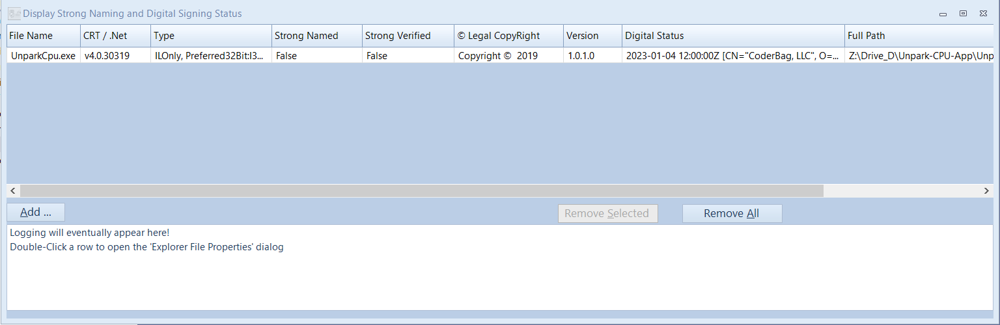

# IsStrongOrSigned
- Display if a file is "Strong Named" and / or "Digitally signed"
  
  
# Done:
- [x] Multi-select open files
  - [x] All files, as pdf's etc can be signed
- [x] Display Files:
  - [x] Base .Net Target Framework 
  - [x] Bitness (Preffered and native)
  - [x] "Strong Named" status
  - [x] "Strong named verification against certificate"status
  - [x] Copyright string
  - [x] Version string
  - [x] Digital Status (First found signed certificate only)
    - [x] Valid "upto" date string
    - [x] Certificate string
  - [x] Path of the found file
- [x] "Add ..." more files 
- [x] "Removal of All" or selected lines
- [x] Dynamic progress bar when loading lots of files
- [x] Column sorting
- [x] Column sizing
- [x] "File Properties" via Windows _Shell API_ callout

# To Do:
- [ ] Logging
  - [ ] Any
  - [ ] File Progress
  - [ ] Any failures in reading data elements for display
- [ ] Allow Export / Copy of grid displayed data
- [ ] Reporting of any "weird" exceptions (Via Exceptionless)
- [ ] Other file data
- [ ] Language handling
- [ ] Alow theme changing
  
Please help, by giving any feedback and suggestions via the github "Issues".

# Acknowledgements
## Resharper
Thanks

## DLLExportLister
- Taken from here and then modified
- https://gist.github.com/reigningshells/d4d9d97a59a2aea8890e75c203230e92

## Krypton.Toolkit
- Using the latest "Alpha" build to display data etc. (And allow themeing in the future)

## Microsoft.PowerShell.5.1.ReferenceAssemblies
- along with "Microsoft.PowerShell.Native"

##  NLog
- Will be used for logging back into the app and also logging out to "ApplicationData" directory

## Ookii.Dialogs.WinForms
- Ensure "Vista Style" Open File is enforced
- Use of the _Shell_ Dynamic Progress dialog

## Markdown Monster
- Creation and maintenance of this readme ;-)

